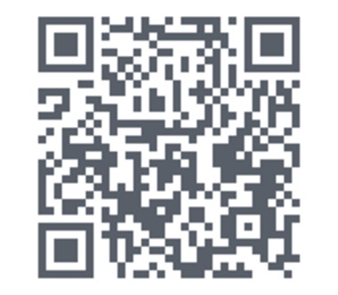
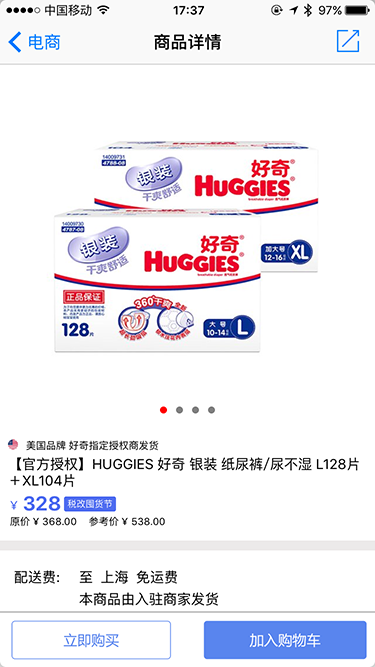
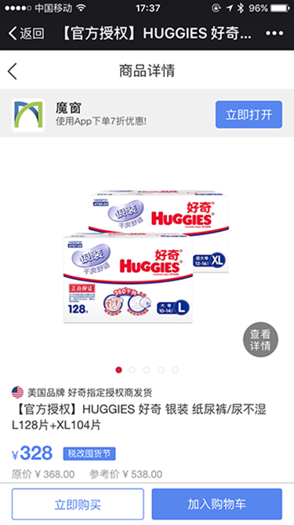
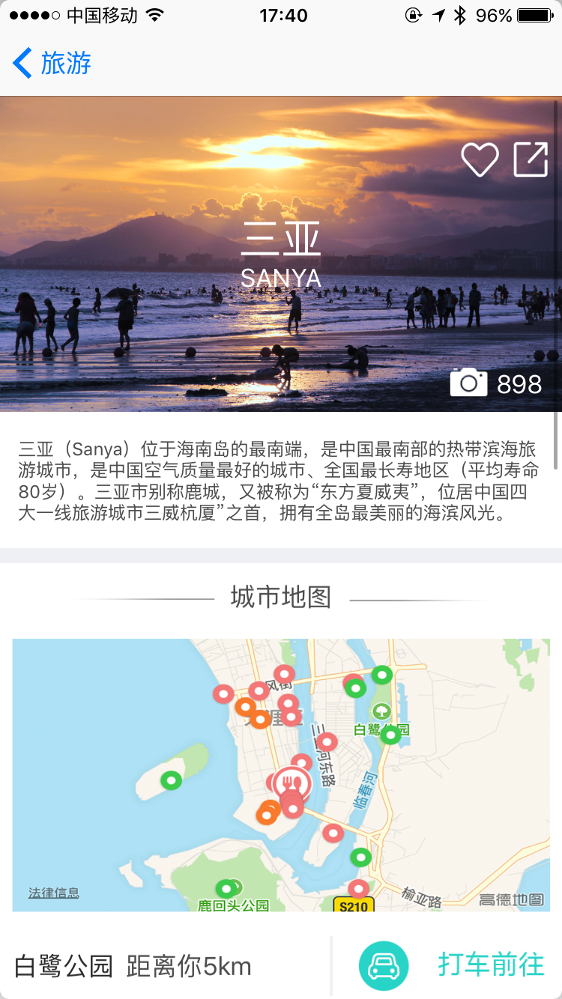
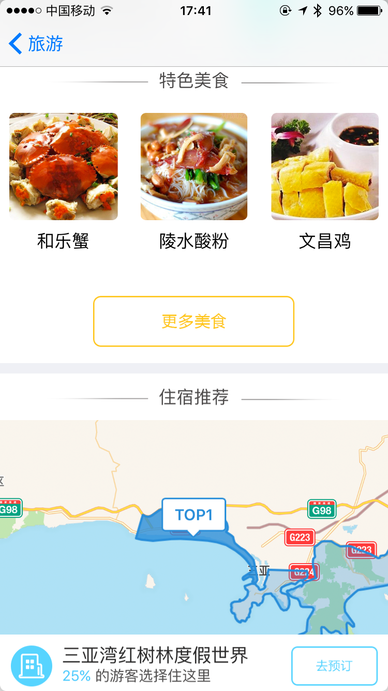

#Demo App使用说明
[魔窗](http://www.magicwindow.cn)——App Growth Engine，通过对Deep Link协议的深度改造以及上层应用层建设，为App提供变革式的面向服务的开发方式，真正打破App孤岛格局，提供极致用户体验，大幅度提升App全生命周期中的转化率，让每一个App都可以轻松情景式相连；与此同时，魔窗提供了专属联合活动以及自运营活动，助力App拉新、促活和留存。 

iOS版本的demo下载地址： 

感谢您体验魔窗Demo App，本Demo主要演示两块内容：mLink以及运营活动。 
一、mLink： 
1、应用内容分享到微信中的一键唤起： 
进入电商页面，拉到最下方，点击图片进入商品的单页 

 
点击右上角分享内容到微信中，在微信中打开页面，点击右上角立即打开一键直达App对应内容页 

 
2、应用间带参数的跳转： 
点击旅游菜单下的“东方的夏威夷”，进入三亚的旅游介绍页面 
（1）点击“打车前往”，唤起Uber App同时自动填充目的地 

 
（2）点击“更多美食”，唤起大众点评App三亚的美食商户列表页 
（3）点击“去预订”，唤起携程App国内某酒店的详情页面 

 
（4）点击第一个“限时特惠”，唤起携程App机票查询列表页 

 
3、H5页面跳转： 
点击旅游菜单下的“带参数跳转到大众点评”，H5中的三个button点击以后，可以分别跳转到上海肯德基列表页、北京星巴克列表页、具体一家星巴克店的店铺详情页。 
4、未安装App情况下支持跳转到Landing Page： 
Banner下图片03：未安装App带参跳转。点击图片后，会跳转到另一个landing page，点击下载跳转的App，打开后会打开跳转App的商品页，显示三个酒名。 
Banner下图片04：安装App带参跳转。点击图片后，打开跳转的App中的商品页。显示另外三个酒名。 

二、运营活动 

 

Banner01：联合抽奖活动。用户可以参加由多家App联合发起的抽奖活动，在这个活动中，用户可能抽取到任意一家App的奖品。 

Banner02：许愿树。用户可以摇一摇选择自己想要的奖品，选取后分享到微信中让好友助力，好友助力后达到奖品规定的助力数后，就可以去App中兑换奖品。 

Banner03：e地推。这是一个类似团购的活动，团长可以发起拼团，当达到一定的拼团人数后，团内所有人可以以一个较低的价格获得商品，这个商品可以是需要支付的，也可以是免费的。 

Banner04：超级大转盘。这是一个比较常见的大转盘活动，适用于各种场景，支持不同的用户组抽中不同的奖品。 

中间区域8个icon：支持用户在节假日的时候，根据自己的需求，替换成不同的icon图片，比如元宵来临，我们将上面的文字换成了“魔窗祝您元宵快乐” 

图片01：分享送优惠券。用户进入活动时会随机获得一定的优惠券，分享到微信后，好友也可以在微信中领取优惠券。 

图片02：加油赢好礼。用户参与活动后分享到微信中让好友帮忙加油，达到一定的加油数以后，可以获得奖品。 

图片03：砍价。用户参与后可以将页面分享给微信好友，好友点击砍价后可以随机砍掉一定价格，用户可以以砍价后的价格来购买商品。 

图片04：用户调研。调研表单，用户填写调研表单后，可以在后台查看填写的结果。  

图片05：每日签到。用户每日签到后可以获得一定的积分或者优惠券，每日签到事件独立。 

图片06：意见反馈。用户可以填写对App的意见反馈。 

图片07：邀请码。用户将邀请码分享给好友后，其他好友输入邀请码后，用户和好友都能获得积分或优惠券。
